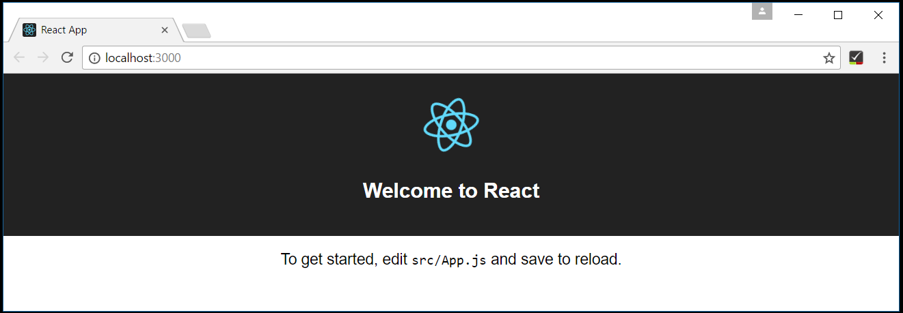
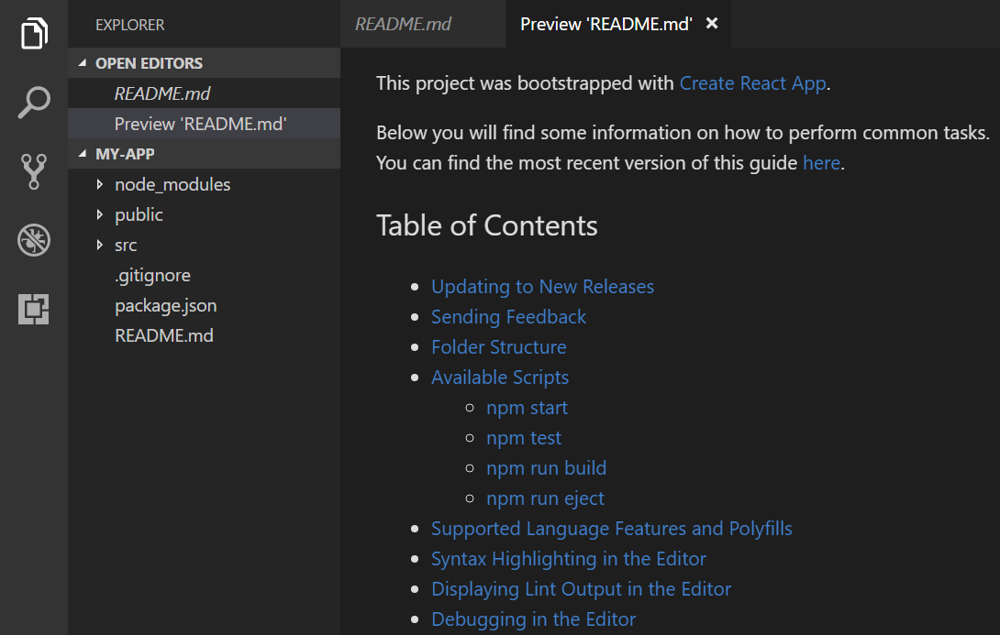
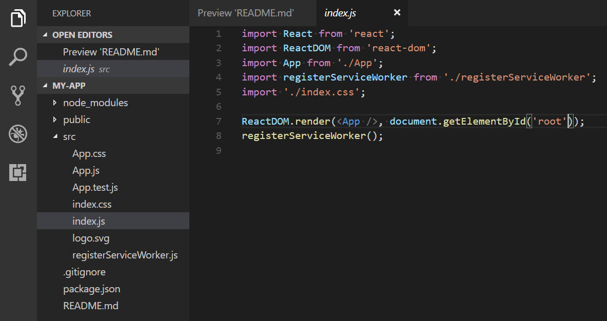
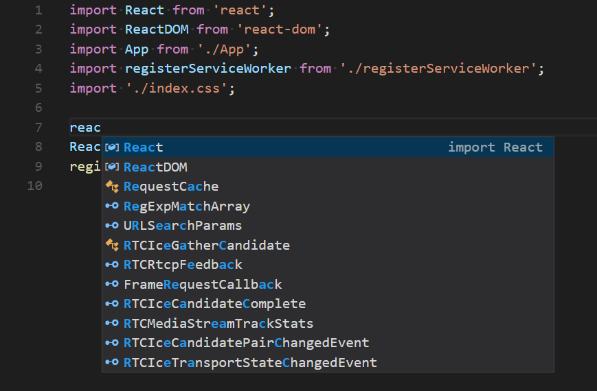
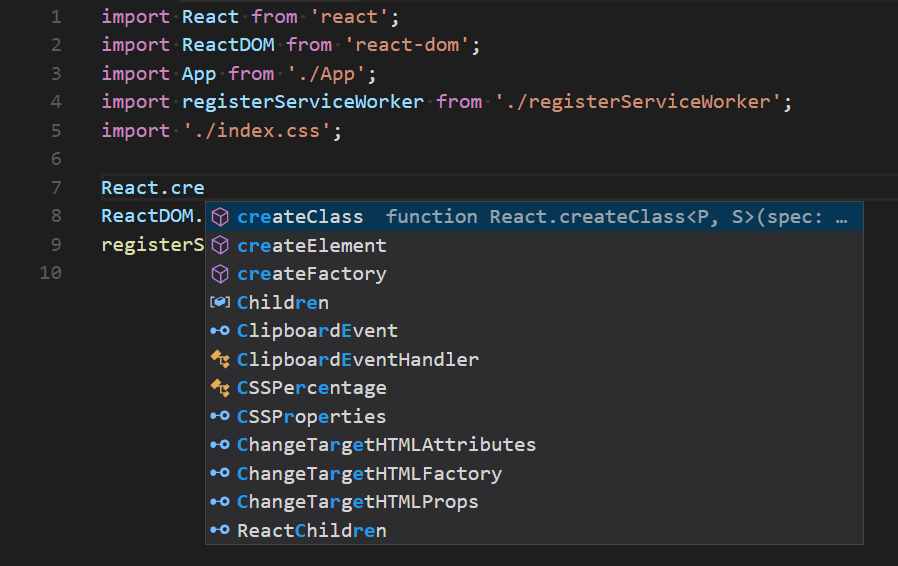
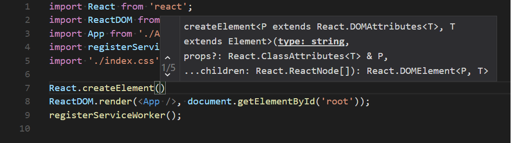
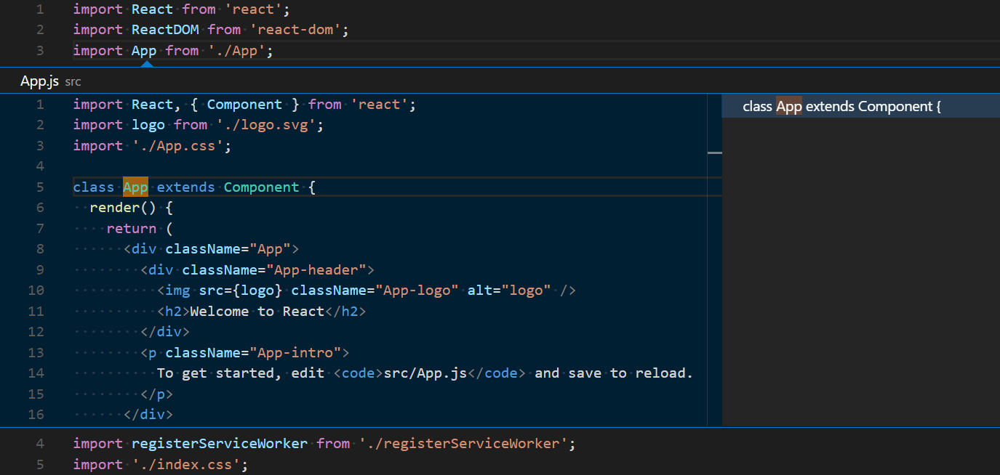
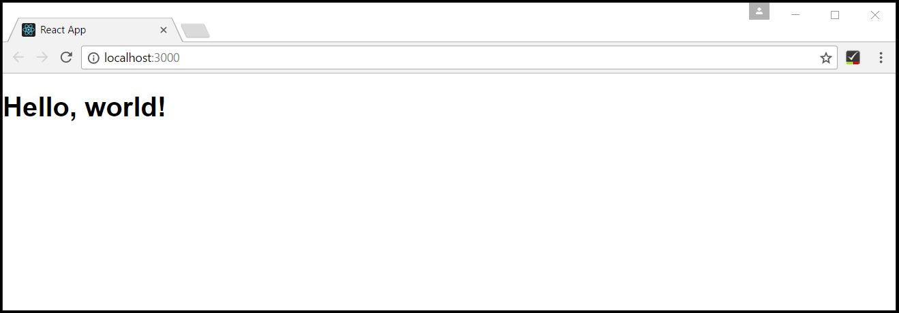
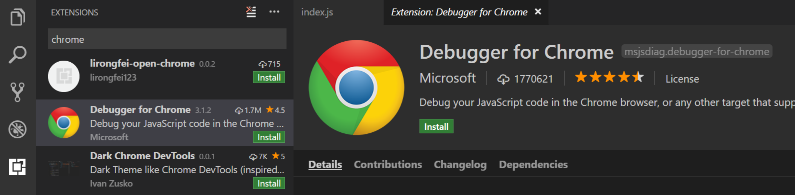
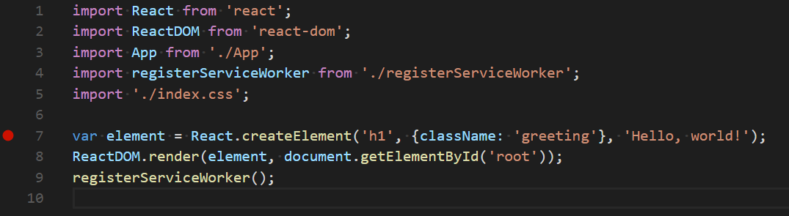

# VS Code で React チュートリアル
# React Tutorial in VS Code

[React](https://facebook.github.io/react/).js は、 Facebook によって開発された Web アプリケーションのユーザーインターフェイスを構築するための人気のある JavaScript ライブラリです。
VS Code は React.js IntelliSense と box 外のコードナビゲーションをサポートしています。

## Hello World

このチュートリアルでは、 `create-react-app` [generator](https://facebook.github.io/react/docs/installation.html#creating-a-new-application) を使用します。 React アプリケーションサーバーを実行するだけでなくジェネレータをインストールして使用するには、[Node.js](https://nodejs.org/) JavaScriptランタイムと [npm](https://www.npm.js.com/) (Node.js パッケージマネージャ) がインストールされていることが必要です。 Node.js は [here]（https://nodejs.org/en/download/）からインストールでき、 npm も含まれています。

> **ヒント**: Node.js と npm がマシンに正しくインストールされていることをテストするには、 `node --version` と ` npm --version` と入力します。

`create-react-app` ジェネレータをインストールするには、端末またはコマンドプロンプトで次のように入力します。

```bash
npm install -g create-react-app
```

インストールには数分かかることがあります。次のように入力して、新しい React アプリケーションを作成できるようになりました:

```bash
create-react-app my-app
```

ここで `my-app` はアプリケーションのフォルダ名です。 React アプリケーションを作成して依存関係をインストールするには、これも数分かかることがあります。

新しいフォルダに移動し、 `npm start` と入力して Web サーバを起動し、ブラウザでアプリケーションを開くことで React アプリケーションをすぐに実行しましょう:

```bash
cd my-app
npm start
```

ブラウザーの `http://localhost:3000` に "Welcome to React" と表示されるはずです。 私たちは VS Code でアプリケーションを見ている間、Webサーバーを実行したままにしておきます。



React アプリケーションを VS Code で開くには、別のターミナル（またはコマンドプロンプト）を開き、 `my-app` フォルダに移動して `code .` をタイプします:

```bash
cd my-app
code .
```

### マークダウンプレビュー
### Markdown Preview

ファイルエクスプローラのファイルには、 `README.md` というアプリケーションがあります。これには、アプリケーションと React に関する一般的な情報がたくさんあります。 README を確認するには、 VS Code Markdown Preview を使用する方法があります。 現在のエディタグループ（**Markdown: 開くプレビュー** `kb(markdown.showPreview)`) または新しいエディタグループ（**Markdown: サイドにプレビューを開く** `kb(markdown.showPreviewToSide)`) でプレビューを開くことができます 。ヘッダーへのハイパーリンクのナビゲーションや、コードブロック内の構文のハイライト表示が得られます。



### シンタックスハイライトとブラケットマッチング
### Syntax highlighting and bracket matching

`src` フォルダを開き、 `index.js` ファイルを選択します。 VS Code にはさまざまなソースコード要素の構文が強調表示されていますが、カーソルをかっこに置くと、一致する括弧も選択されます。



### IntelliSense

`index.js` で入力を開始すると、スマートな提案や補完が表示されます。



提案を選択して `.` と入力すると、 IntelliSense を介してオブジェクトの型とメソッドが表示されます。



VS Code は、 JavaScript コードインテリジェンスのために TypeScript 言語サービスを使用し、 `package.json` で参照されている npm モジュールの npm タイプ定義ファイル（`*.d.ts`）をプルダウンします。この機能は Automatic Type Acquisition（ATA）と呼ばれる機能です 。

メソッドを選択すると、パラメータヘルプも表示されます:



### 定義へ移動、定義を抽出

TypeScript 言語サービスを介して、VS Code は、**定義へ移動** (`kb(editor.action.gotodeclaration)`) または ** および **Peek Defintion** (`kb(editor.action.peekImplementation)`)。 `App` の上にカーソルを置き、右クリックして **Peek Definition** を選択します。 `App.js` の `App` 定義を開いたPeekウィンドウ。



`kbstyle(Escape)` を押すと、 Peekウィンドウが閉じます。

### Hello World!

サンプルアプリケーションを "Hello World!" に更新しましょう。 リンクを追加して新しいH1ヘッダを宣言し、 `ReactDOM.render`の `<App/>` タグを`element' に置き換えてください。

```js
import React from 'react';
import ReactDOM from 'react-dom';
import App from './App';
import registerServiceWorker from './registerServiceWorker';
import './index.css';

var element = React.createElement('h1', {className: 'greeting'}, 'Hello, world!');
ReactDOM.render(element, document.getElementById('root'));
registerServiceWorker();
```

`index.js` を保存すると、サーバの実行中のインスタンスがWebページを更新し、 "Hello World!" が表示されます。



## Hello World をデバッグする
## Debug Hello World

クライアント側の React コードをデバッグするには、[Debugger for Chrome](https://marketplace.visualstudio.com/items?itemName=msjsdiag.debugger-for-chrome) 拡張機能をインストールする必要があります。

>注意: このチュートリアルでは、Chromeブラウザがインストールされていることを前提としています。 Debugger for Chrome 拡張機能のビルダーには、[Safari on iOS(https://marketplace.visualstudio.com/items?itemName=msjsdiag.debugger-for-ios-web) と [Edge(https://marketplace.visualstudio.com/items?itemName=msjsdiag.debuggerforge) ブラウザが含まれています。

拡張機能ビュー (`kb(workbench.view.showExtensions)`) を開き、検索ボックスに 'chrome` と入力します。 Chrome を参照するいくつかの拡張機能が表示されます。



**Debug** for Chrome **の** Install **ボタンを押してください。ボタンは、**インストール** **リロード**に変わります。 ** Reload **を押してVSコードを再起動し、内線番号を有効にします。

### ブレークポイントを設定する
### Set a breakpoint

`index.js` にブレークポイントを設定するには、行番号の左側にあるガターをクリックします。これにより、赤い円として表示されるブレークポイントが設定されます。



## Chrome デバッガを設定する
## Configure the Chrome debugger

最初にデバッガを設定する必要があります。これを行うには、デバッグビュー (`kb(workbench.view.debug)`) に行きます。

構成

shutdown localhost:3000、F5、リフレッシュ

## Linting

デフォルトで js エラーを取得する

```bash
npm install -g eslint
```

## [Popular Starter Kit]
## [人気スターターキット]
