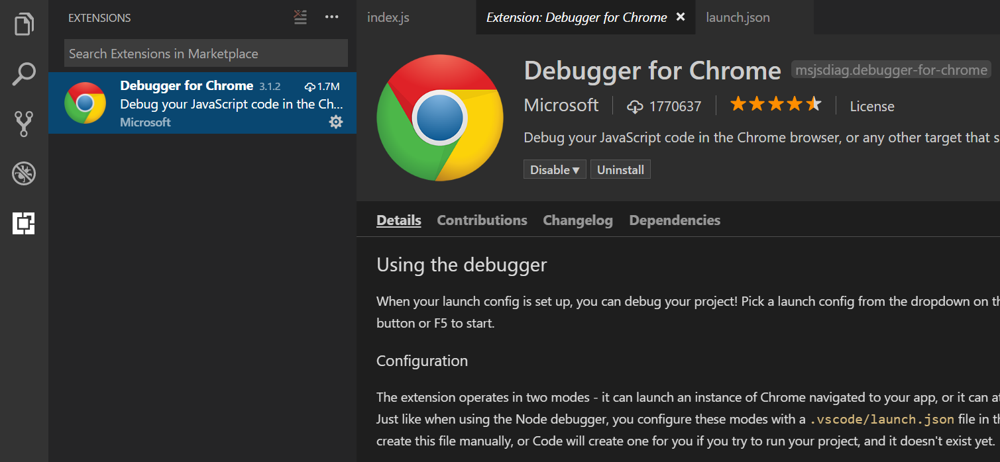

---
Order:
Area: nodejs
TOCTitle: React Tutorial
ContentId: 2dd2eeff-2eb3-4a0c-a59d-ea9a0b10c468
PageTitle: React JavaScript Tutorial in VS Code
DateApproved: 3/10/2017
MetaDescription: React JavaScript tutorial showing IntelliSense, debugging, and code navigation support in Visual Studio Code.
MetaSocialImage: nodejs_javascript_vscode.png
---
# VS Code で React チュートリアル
# React Tutorial in VS Code

[React](https://facebook.github.io/react/).js は、 Facebook によって開発された Web アプリケーションのユーザーインターフェイスを構築するための人気のある JavaScript ライブラリです。
VS Code は React.js IntelliSense と box 外のコードナビゲーションをサポートしています。


## Welcome to React

このチュートリアルでは、 `create-react-app` [generator](https://facebook.github.io/react/docs/installation.html#creating-a-new-application) を使用します。 React アプリケーションサーバーを実行するだけでなくジェネレータをインストールして使用するには、[Node.js](https://nodejs.org/) JavaScriptランタイムと [npm](https://www.npm.js.com/) (Node.js パッケージマネージャ) がインストールされていることが必要です。 Node.js は [here]（https://nodejs.org/en/download/）からインストールでき、 npm も含まれています。

> **ヒント**: Node.js と npm がマシンに正しくインストールされていることをテストするには、 `node --version` と ` npm --version` と入力します。

`create-react-app` ジェネレータをインストールするには、端末またはコマンドプロンプトで次のように入力します。

```bash
npm install -g create-react-app
```

インストールには数分かかることがあります。次のように入力して、新しい React アプリケーションを作成できるようになりました:

```bash
create-react-app my-app
```

ここで `my-app` はアプリケーションのフォルダ名です。 React アプリケーションを作成して依存関係をインストールするには、これも数分かかることがあります。

新しいフォルダに移動し、 `npm start` と入力して Web サーバを起動し、ブラウザでアプリケーションを開くことで React アプリケーションをすぐに実行しましょう:

```bash
cd my-app
npm start
```

ブラウザーの `http://localhost:3000` に "Welcome to React" と表示されるはずです。 私たちは VS Code でアプリケーションを見ている間、Webサーバーを実行したままにしておきます。

React アプリケーションをVSコードで開くには、別のターミナル (またはコマンドプロンプト) を開き、 `my-app` フォルダに移動して `code .` と打ちます:

```bash
cd my-app
code .
```

### マークダウンプレビュー
### Markdown Preview

ファイルエクスプローラのファイルには、 `README.md` というアプリケーションがあります。これには、アプリケーションと React に関する一般的な情報がたくさんあります。 README を確認するには、 VS Code Markdown Preview を使用する方法があります。 現在のエディタグループ（**Markdown: 開くプレビュー** `kb(markdown.showPreview)`) または新しいエディタグループ（**Markdown: サイドにプレビューを開く** `kb(markdown.showPreviewToSide)`) でプレビューを開くことができます 。ヘッダーへのハイパーリンクのナビゲーションや、コードブロック内の構文のハイライト表示が得られます。


### シンタックスハイライトとブラケットマッチング
### Syntax highlighting and bracket matching

`src` フォルダを開き、 `index.js` ファイルを選択します。 VS Code にはさまざまなソースコード要素の構文が強調表示されていますが、カーソルをかっこに置くと、一致する括弧も選択されます。


### IntelliSense

`index.js` で入力を開始すると、スマートな提案や補完が表示されます。


提案を選択して `.` と入力すると、 IntelliSense を介してオブジェクトの型とメソッドが表示されます。


VS Code は、 JavaScript コードインテリジェンスのために TypeScript 言語サービスを使用し、 `package.json` で参照されている npm モジュールの npm タイプ定義ファイル（`*.d.ts`）をプルダウンします。この機能は Automatic Type Acquisition（ATA）と呼ばれる機能です 。

メソッドを選択すると、パラメータヘルプも表示されます:


### 定義へ移動、定義を抽出

TypeScript 言語サービスを介して、VS Code は、**定義へ移動** (`kb(editor.action.gotodeclaration)`) または ** および **Peek Defintion** (`kb(editor.action.peekImplementation)`)。 `App` の上にカーソルを置き、右クリックして **Peek Definition** を選択します。 `App.js` の `App` 定義を開いたPeekウィンドウ。


`kbstyle(Escape)` を押すと、 Peekウィンドウが閉じます。

## Hello World!

サンプルアプリケーションを "Hello World!" に更新しましょう。 リンクを追加して新しいH1ヘッダを宣言し、 `ReactDOM.render`の `<App/>` タグを`element' に置き換えてください。

```js
import React from 'react';
import ReactDOM from 'react-dom';
import App from './App';
import registerServiceWorker from './registerServiceWorker';
import './index.css';

var element = React.createElement('h1', { className: 'greeting' }, 'Hello, world!');
ReactDOM.render(element, document.getElementById('root'));
registerServiceWorker();
```

`index.js` を保存すると、サーバの実行中のインスタンスがWebページを更新し、 "Hello World!" が表示されます。

> **ヒント**: VS Code は自動保存機能をサポートしています。デフォルトでは、ファイルは遅れて保存されます。 **ファイル** > **自動保存** をチェックして自動保存を有効にするか、 直接 `files.autoSave` ユーザ[設定](/docs/getstarted/settings.md) を設定してください。


## React のデバッグ
## Debugging React

クライアント側の React コードをデバッグするには、[Debugger for Chrome](https://marketplace.visualstudio.com/items?itemName=msjsdiag.debugger-for-chrome) 拡張機能をインストールする必要があります。

>Note: This tutorial assumes you have the Chrome browser installed. The builders of the Debugger for Chrome extension also have versions for the [Safari on iOS](https://marketplace.visualstudio.com/items?itemName=msjsdiag.debugger-for-ios-web) and [Edge](https://marketplace.visualstudio.com/items?itemName=msjsdiag.debugger-for-edge) browsers.

>注意: このチュートリアルでは、Chromeブラウザがインストールされていることを前提としています。 Debugger for Chrome拡張機能のビルダーには、[Safari on iOS](https://marketplace.visualstudio.com/items?itemName=msjsdiag.debugger-for-ios-web) および [Edge](https://marketplace.visualstudio.com/items?itemName=msjsdiag.debugger-for-edge)ブラウザ用のバージョンも用意されています。

拡張機能ビュー (`kb(workbench.view.showExtensions)`) を開き、検索ボックスに 'chrome` と入力します。 Chrome を参照するいくつかの拡張機能が表示されます。


**Debug** for Chrome **の **Install** ボタンを押してください。 ボタンは、**インストール** **リロード** に変わります。 **Reload** を押してVSコードを再起動し、内線番号を有効にします。

### ブレークポイントを設定する
### Set a breakpoint

`index.js` にブレークポイントを設定するには、行番号の左側にあるガターをクリックします。これにより、赤い円として表示されるブレークポイントが設定されます。


### Chrome デバッガを設定する
### Configure the Chrome debugger

We need to initially configure the debugger. To do so, go to the Debug view (`kb(workbench.view.debug)`) and click on gear button to create a `launch.json` debugger configuration file. Choose **Chrome** from the **Select Environment** dropdown. This will create a `launch.json` file in a new `.vscode` folder in your project which includes configuration to both launch the website or attach to a running instance.

We need to make one change for our example which is runninng on localhost port `3000`, not `8080` as in the generated file. Your `launch.json` should look like this:

```json
{
    "version": "0.2.0",
    "configurations": [
        {
            "type": "chrome",
            "request": "launch",
            "name": "Launch Chrome against localhost",
            "url": "http://localhost:3000",
            "webRoot": "${workspaceRoot}"
        },
        {
            "type": "chrome",
            "request": "attach",
            "name": "Attach to Chrome",
            "port": 9222,
            "webRoot": "${workspaceRoot}"
        }
    ]
}
```

Press `kb(workbench.action.debug.start)` or the green arrow to launch the debugger and open a new browser instance. The source code where the breakpoint is set runs on startup before the debugger was attached so we won't hit the breakpoint until we refresh the web page. Refresh the page and you should hit your breakpoint.


You can step through your source code (`kb(workbench.action.debug.stepOver)`), inspect variables such as `element`, and see the call stack of the client side React application.


The **Debugger for Chrome** extension README has lots of information on other configurations, working with sourcemaps, and troubleshooting and you can review it directly within VS Code from the **Extensions** view by clicking on the extension item and opening the **Details** view.



## Linting

Linters analyze your source code and can warn you about potential problems before you run your application. VS Code include JavaScript language service has syntax error checking support support by default which you can see in action in the **Problems** panel (**View** > **Problems** `kb(workbench.action.view.problems)`).

Try making a small error in your React source code and you'll see a red squiggly and a warning in the **Problems** panel.


Linters can provide more sophisticated analysis, enforcing coding conventions and detecting anti-patterns. A popular JavaScript linter is [ESLint](http://eslint.org/). ESLint when combined with the ESLint VS Code [extension](https://marketplace.visualstudio.com/items/dbaeumer.vscode-eslint) provides a great in-product linting experience.

First install the ESLint command line tool:

```bash
npm install -g eslint
```

Then install the ESLint extension by going to the **Extensions** view and typing 'eslint'.


Once the ESLint extension is installed and VS Code reloaded, you'll want to create an ESLint configuration file `eslintrc.json`. You can create one using the extension's **ESLint: Create 'eslintrc.json' File** command from the **Command Palette** (`kb(workbench.actions.showCommands)`).


The command will create a `.eslintrc.json` file in your project root:

```json
{
    "env": {
        "browser": true,
        "commonjs": true,
        "es6": true,
        "node": true
    },
    "parserOptions": {
        "ecmaFeatures": {
            "jsx": true
        },
        "sourceType": "module"
    },
    "rules": {
        "no-const-assign": "warn",
        "no-this-before-super": "warn",
        "no-undef": "warn",
        "no-unreachable": "warn",
        "no-unused-vars": "warn",
        "constructor-super": "warn",
        "valid-typeof": "warn"
    }
}
```

ESLint will now analyze open files and shows a warning in `index.js` about 'App' being defined but never used.

 

 You can modify the ESLint [rules](http://eslint.org/docs/rules/) and the ESLint extension provides IntelliSense.


Let's add an error rule for extra semi-colons:

```json
 "rules": {
        "no-const-assign": "warn",
        "no-this-before-super": "warn",
        "no-undef": "warn",
        "no-unreachable": "warn",
        "no-unused-vars": "warn",
        "constructor-super": "warn",
        "valid-typeof": "warn",
        "no-extra-semi":"error"
    }
```


## Popular Starter Kits

In this tutorial, we used the `create-react-app` generator to create a simple React application. There are lots of great samples and starter kits available to help build your first React application.

### VS Code React Sample

This is a [sample](https://github.com/Microsoft/vscode-react-sample) React application used for a [demo](https://channel9.msdn.com/events/Build/2017/T6078) at this year's //Build conference. The sample creates a simple TODO application and includes the source code for a Node.js [Express](https://expressjs.com/) server and uses the [Babel](https://babeljs.io) ES6 transpiler and [webpack](https://webpack.js.org/) to bundle the site assets.

### MERN Starter

If you'd like to see a full MERN (MongoDB, Express, React, Node.js) stack example, look at the [MERN Starter](http://mern.io/). You'll need to install and start [MongoDB](https://docs.mongodb.com/v3.0/installation/) but you'll quickly have a MERN application running. There is helpful VS Code-specific documentation at [vscode-recipes](https://github.com/weinand/vscode-recipes/tree/master/MERN-Starter) which details setting up Node.js server debugging.

### TypeScript React

If you're curious about TypeScript and React, you can also create a TypeScript version of the `create-react-app` application. See the details at [TypeScript-React-Starter](https://github.com/Microsoft/TypeScript-React-Starter) on the [TypeScript Quick Start](http://www.typescriptlang.org/samples/index.html) site.
